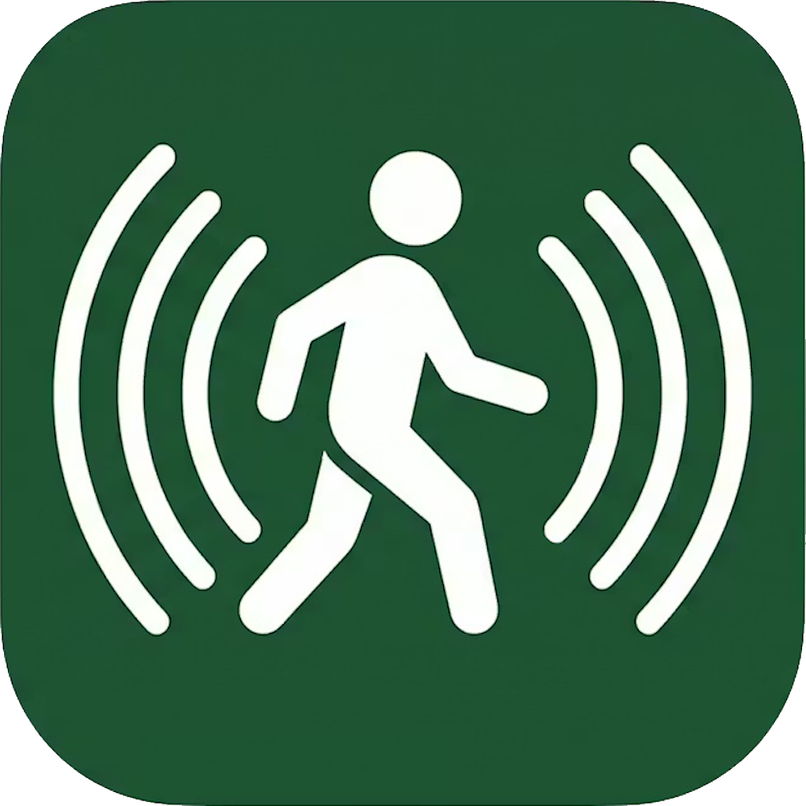
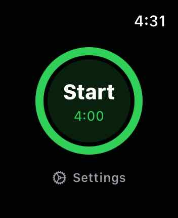
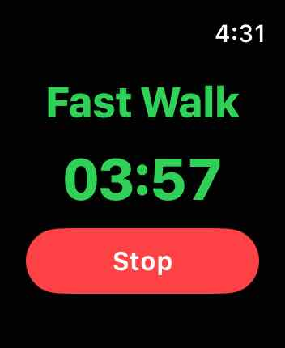
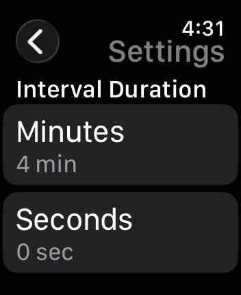
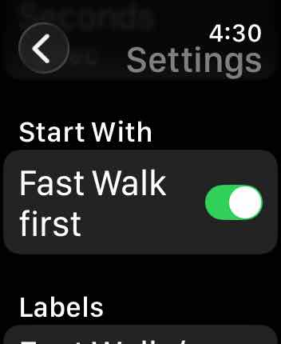
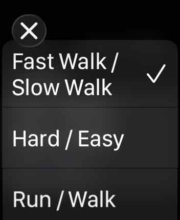
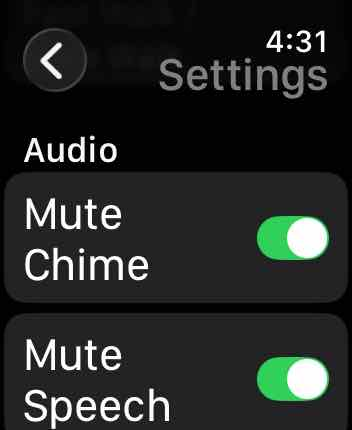

# Japanese Walk Timer

An open-source Apple Watch app for the Japanese Walking Method — alternating intervals of fast and slow walking.

## What is Japanese Walking?

The Japanese Walking Method (interval walking training) alternates between periods of brisk walking and easy recovery walking. Studies have shown it improves aerobic fitness and reduces blood pressure more effectively than continuous steady-pace walking.

The default interval is 4 minutes per phase, but the app lets you set any duration.

## Features

- Configurable interval duration (minutes and seconds)
- Haptic alert, chime, and spoken phase name on every transition
- Mute chime and/or speech independently in Settings
- Customisable phase labels (Fast Walk / Slow Walk, Run / Walk, Work / Rest, etc.)
- Choose which phase to start with (hard/easy)
- Tap anywhere on the active screen (except Stop) to skip to the next phase
- Continues running in the background; compatible with simultaneous Apple Fitness workouts

## Screenshots

## Requirements

- watchOS 10+
- Xcode 15+

## License

MIT
